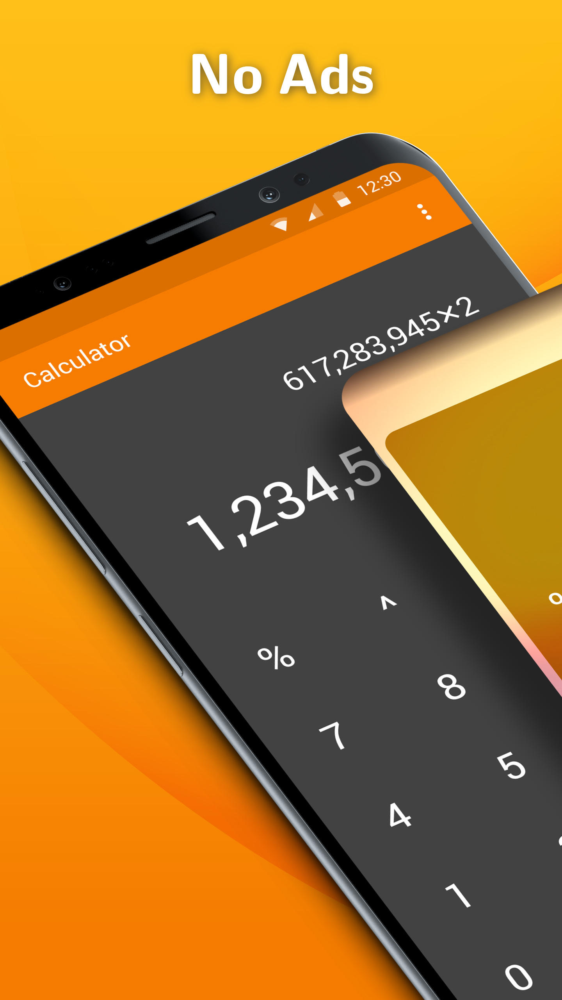
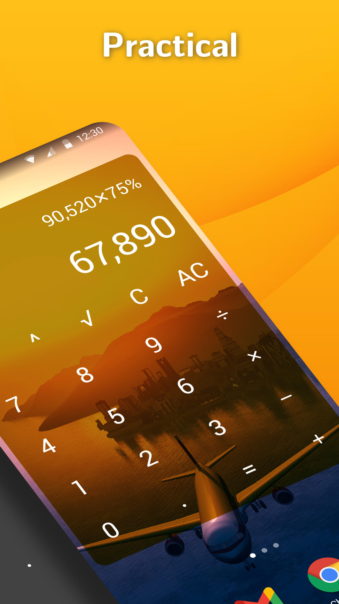

# Simple Calculator

A calculator with the basic functions and a customizable widget.

You can copy the result or formula to clipboard by long pressing it.

The text color of the widget can be customized, as well as the color and the alpha of the background. Press the result or formula in the widget to open the app.

Contains no ads or unnecessary permissions. It is fully opensource, provides customizable colors.

This app is just one piece of a bigger series of apps. You can find the rest of them at https://www.simplemobiletools.com

