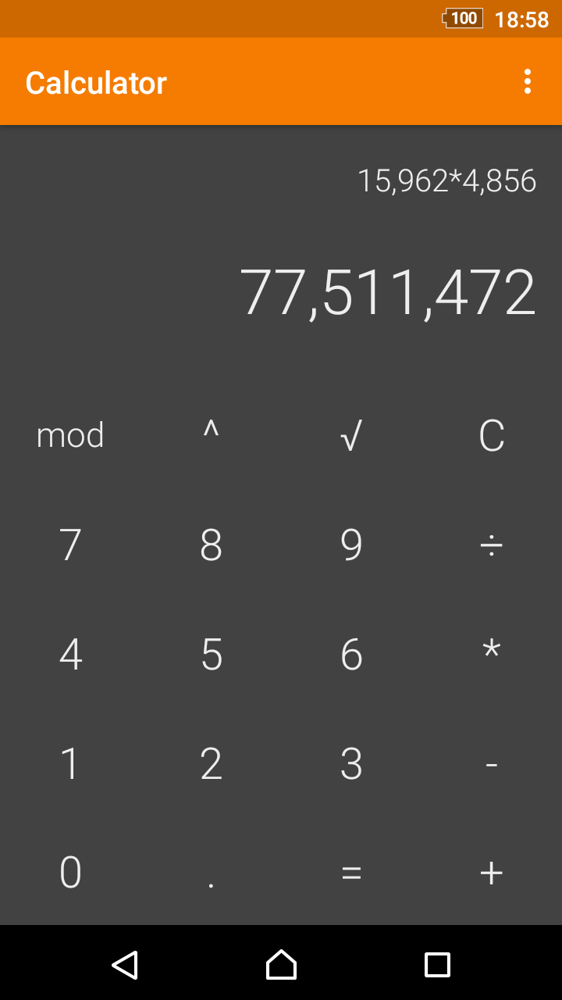
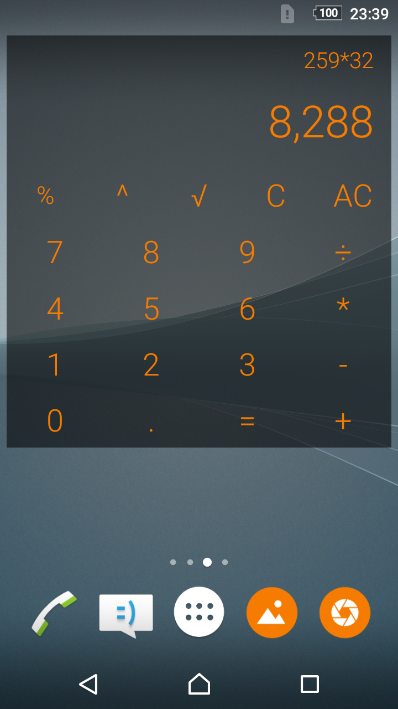

# Simple Calculator

A calculator with the basic functions and a customizable widget.

You can copy the result or formula to clipboard by long pressing it.

The text color of the widget can be customized, as well as the color and the alpha of the background. Press the result or formula in the widget to open the app.

Contains no ads or unnecessary permissions. It is fully opensource, provides customizable colors.

This app is just one piece of a bigger series of apps. You can find the rest of them at http://www.simplemobiletools.com

 
It contains a couple UI and unit tests, they can be ran with the following instructions.

<h3>Running Espresso UI tests</h3>

1. Run -> Edit Configurations

2. Create a new "Android Instrumentation Tests" configuration, give it a name (i.e. "MainActivityEspressoTest")

3. Choose the "app" module

4. OK

5. Make sure MainActivityEspressoTest is selected near the Run button

6. Run

<h3>Running Robolectric tests</h3>

1. At the Project tab right click the folder containing the tests (i.e. "calculator.simplemobiletools.com.simple_calculator (test)")

2. select Run 'Tests in 'calculator.simplemob...' to run all the tests

3. if you are on Linux or Mac, go to Run -> Edit Configurations, select the new JUnit configuration and change the "Working Directory" item to "$MODULE_DIR$" (without quotes)

4. OK

5. Run

License
-------
    Copyright 2016-present SimpleMobileTools
    
    Licensed under the Apache License, Version 2.0 (the "License");
    you may not use this file except in compliance with the License.
    You may obtain a copy of the License at
    
       http://www.apache.org/licenses/LICENSE-2.0
    
    Unless required by applicable law or agreed to in writing, software
    distributed under the License is distributed on an "AS IS" BASIS,
    WITHOUT WARRANTIES OR CONDITIONS OF ANY KIND, either express or implied.
    See the License for the specific language governing permissions and
    limitations under the License.
