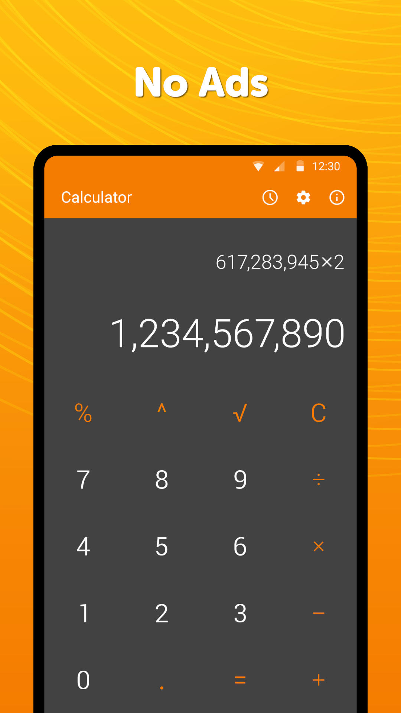
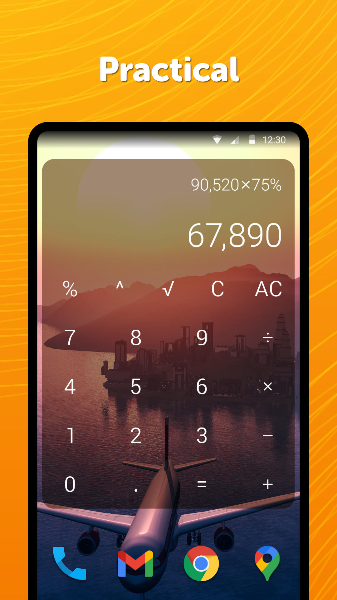
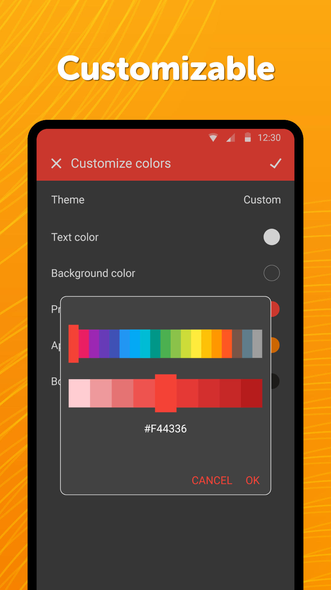

# Simple Calculator

This stylish modern calculator offers great user experience that you will love seeing. You can copy the result or formula to clipboard by long pressing it.

The app is a simple helper for fast calculations with many basic functions including multiplying, dividing, root and powers.

You can make it vibrate on button presses to make you confident during inserting your values.

There is an option to prevent the phone from sleeping while using the app for comfortable usage.

The text color of the resizable widget can be customized, as well as the color and the alpha of the background. Press the result or formula in the widget to open the app.

It comes with material design and dark theme by default, provides great user experience for easy usage. The lack of internet access gives you more privacy, security and stability than other apps.

Contains no ads or unnecessary permissions. It is fully opensource, provides customizable colors.

<b>Check out the full suite of Simple Tools here:</b>  
https://www.simplemobiletools.com

Facebook:  
https://www.facebook.com/simplemobiletools

Reddit:  
https://www.reddit.com/r/SimpleMobileTools

