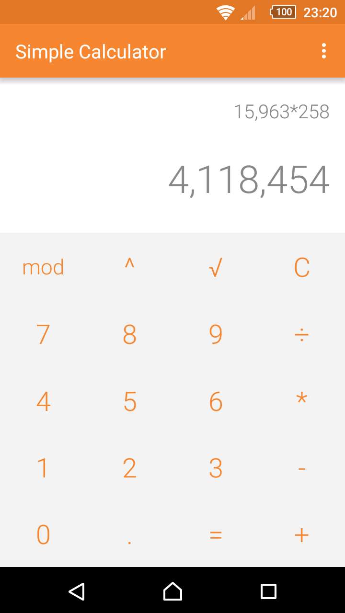
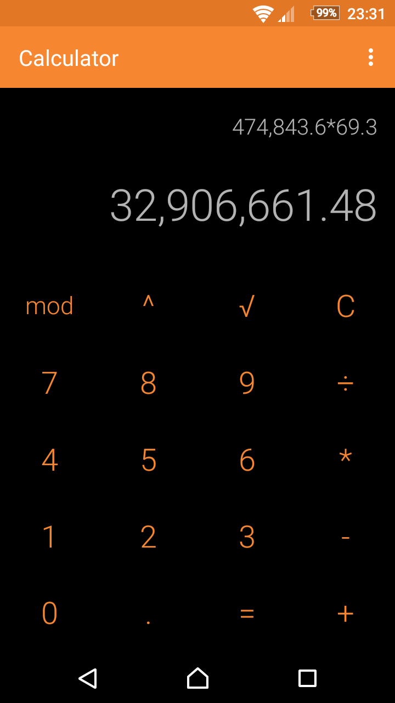
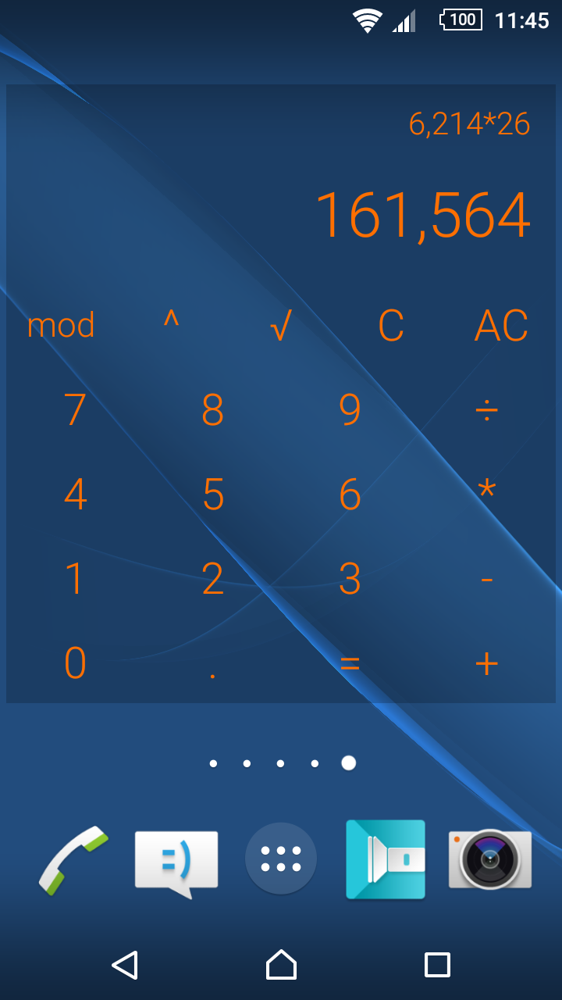

# Simple Calculator

A simple calculator with the basic operations. Long press the result or formula to copy the value to clipboard.

The text color of the widget can be customized, as well as the color and the alpha of the background. Press the result or formula in the widget to open the app.

This app contains no ads or unnecessary permissions. It is fully opensource, provides a Dark theme too.

It contains a couple UI and unit tests, they can be ran with the following instructions.

<h3>Running Espresso UI tests</h3>
1. at Build Variants select "Android Instrumentation Tests"
2. Run -> Edit Configurations
3. create a new "Android Tests" configuration, give it a name (i.e. "MainActivityEspressoTest")
4. choose the "app" module
5. OK
6. make sure MainActivityEspressoTest is selected near the Run button
7. Run

<h3>Running Robolectric tests</h3>
1. at Build Variant select "Unit Tests"
2. at the Project tab right click the folder containing the tests (i.e. "calculator.simplemobiletools.com.simple_calculator (test)")
3. select Run 'Tests in 'calculator.simplemob...' to run all the tests
4. if you are on Linux or Mac, go to Run -> Edit Configurations, select the new JUnit configuration and change the "Working Directory" item to "$MODULE_DIR" (without quotes)
5. OK
6. Run

License
-------
    Copyright 2016 SimpleMobileTools
    
    Licensed under the Apache License, Version 2.0 (the "License");
    you may not use this file except in compliance with the License.
    You may obtain a copy of the License at
    
       http://www.apache.org/licenses/LICENSE-2.0
    
    Unless required by applicable law or agreed to in writing, software
    distributed under the License is distributed on an "AS IS" BASIS,
    WITHOUT WARRANTIES OR CONDITIONS OF ANY KIND, either express or implied.
    See the License for the specific language governing permissions and
    limitations under the License.
